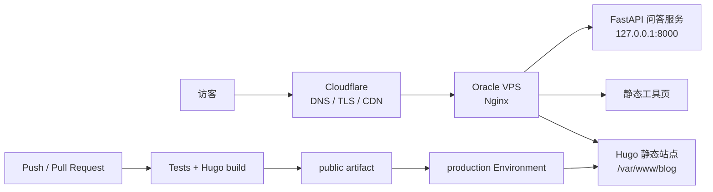

# Estevan Cyber

[](https://gohugo.io/)
[](tests/)
[](https://github.com/Estevan233/Estevan_Cyber/actions/workflows/site.yml)

Estevan 的个人网站源码。它以 Hugo 生成静态内容，用幕布式首屏承载视觉识别，再通过时间进度、标签、歌单、文章、项目和问答入口逐层披露内容。

仓库同时保存页面契约测试、设计与实施文档，以及一条带校验、备份和回滚的 Oracle VPS 发布链路。线上服务不需要在服务器上临时拉代码和编译。

## 在线站点

- 主站：[estevancyber.net](https://estevancyber.net/)
- 博客：[blog.estevancyber.net](https://blog.estevancyber.net/)
- 本次首页改造教程：[从毛坯首页到幕布式个人网站](https://blog.estevancyber.net/posts/curtain-homepage-design-and-deployment/)

## 功能

- 全屏幕布式 Hero，每日稳定轮换本地精选图片。
- 今天、本周、本月、今年四类本地时间进度。
- Hugo 标签入口、最新文章、项目、工具和知识库问答。
- 3 至 5 首可手动维护的自托管歌单。
- 明暗主题、移动端布局和 `prefers-reduced-motion` 支持。
- Node.js 算法测试、页面契约测试和内容契约测试。
- GitHub Actions 构建 artifact，SSH 暂存，生产探针和失败回滚。

## 架构



Hugo 站点、工具页和问答 API 在 Nginx 层按 Host 分流。CI/CD 只替换 Hugo 静态目录，不重启 API、Docker 或其他端口服务。

## 技术栈

| 范围 | 技术 |
| --- | --- |
| 静态站点 | Hugo Extended 0.164.0 + PaperMod |
| 页面 | Hugo templates、HTML、原生 CSS、原生 JavaScript |
| 内容 | Markdown Page Bundles、YAML data files |
| 测试 | Node.js 20+ 内置 test runner |
| 发布 | GitHub Actions、SSH、rsync、Bash |
| 运行 | Nginx、Cloudflare、Oracle Cloud VPS |

## 项目结构

```text
assets/                  首页 CSS、JavaScript 和图像资源
content/                 页面与文章；文章优先使用 Page Bundle
data/                    Hero、关注项和歌单等手动维护数据
layouts/                 首页和问答页的自定义 Hugo 模板
static/                  不经 Hugo 处理的静态文件与音频
tests/                   算法、页面、内容和部署契约测试
scripts/                 远端生产部署脚本
.github/workflows/       构建与发布工作流
docs/superpowers/        设计规格和实施计划
agent-api/               独立知识库问答服务
themes/PaperMod/         Hugo 主题子模块
```

第三方图片、音乐和主题来源见 [THIRD_PARTY_NOTICES.md](THIRD_PARTY_NOTICES.md)。

## 本地开发

要求：Git、Node.js 20+、Hugo Extended 0.164.0。

```bash
git clone --recurse-submodules https://github.com/Estevan233/Estevan_Cyber.git
cd Estevan_Cyber
hugo server -D
```

浏览器访问 `http://127.0.0.1:1313/`。如果已经普通克隆但主题目录为空：

```bash
git submodule update --init --recursive
```

## 写作与内容维护

文章使用 Page Bundle，让正文、封面和配图放在同一个目录：

```text
content/posts/my-new-post/
├── index.md
├── cover.jpg
└── architecture.svg
```

`index.md` 最小 front matter：

```yaml
---
title: "文章标题"
date: 2026-08-13
draft: true
tags: ["Hugo", "学习笔记"]
summary: "一段用于列表页和 SEO 的摘要。"
cover:
  image: "cover.jpg"
  alt: "准确描述图片内容"
---
```

维护入口：

- `content/posts/`：新增和修改博客文章。
- `data/hero-images.yaml`：首屏图片池及来源信息。
- `data/playlist.yaml`：歌单曲目、作者、封面和音频路径。
- `data/focus.yaml`：首页“最近在做”内容。

本地预览草稿使用 `hugo server -D`；准备发布时把 `draft` 改为 `false`。新增媒体前要确认授权，并同步更新 `THIRD_PARTY_NOTICES.md`。

## 测试与构建

```bash
node --test tests/*.test.js
hugo --gc --minify --environment production --cleanDestinationDir
```

生产输出位于 `public/`，该目录是生成物，不应作为内容源手工编辑。提交前至少确认：

1. Node 测试全部通过。
2. Hugo 构建没有错误。
3. 首页和新文章在桌面、手机宽度下无横向溢出。
4. 图片、音频、站内链接和浏览器控制台正常。

## 自动部署

`.github/workflows/site.yml` 在 Pull Request、`main` 推送和手动触发时执行验证。生产部署还需要 GitHub `production` Environment：

| 类型 | 名称 | 用途 |
| --- | --- | --- |
| Repository variable | `ENABLE_VPS_DEPLOY` | 设为 `true` 后才允许部署 |
| Environment variable | `VPS_HOST` | VPS 主机名或 IP |
| Environment variable | `VPS_USER` | SSH 用户 |
| Environment variable | `VPS_PORT` | SSH 端口，可选，默认 22 |
| Environment secret | `VPS_SSH_KEY` | 专用部署私钥完整内容 |

建议为 `production` 设置 required reviewer 和仅 `main` 可部署的分支规则。首次启用前先手动运行 workflow，确认 artifact、暂存路径、备份和探针都符合预期。

远端脚本 `scripts/deploy-site.sh` 只接收 `/tmp/estevancyber-release-*` 暂存目录和 40 位 Git SHA。它会校验关键文件、备份当前站点、原子切换目录，并在 Nginx 或 HTTPS 探针失败时恢复上一版本。

## 安全

- 不在仓库、文章、Issue、Actions 日志中提交真实私钥、API key、token 或 `.env`。
- `VPS_SSH_KEY` 使用专用低权限部署密钥，不复用个人管理员私钥。
- 源站 IP、内部端口和本机路径在公开教程中使用示例值或抽象名称。
- GitHub Actions 使用最小 `contents: read` 权限，并固定第三方 Action 的提交 SHA。
- Cloudflare 保持 `Full (strict)`，源站证书和密钥只保存在服务器。
- 发布失败先回滚，再调查；不要在生产目录里边删边试。

## 相关文档

- [首页设计规格](docs/superpowers/specs/2026-08-13-progress-tutorial-cicd-design.md)
- [实施计划](docs/superpowers/plans/2026-08-13-progress-tutorial-cicd.md)
- [问答服务部署](docs/deployment/knowledge-agent-vps.md)
- [第三方资源声明](THIRD_PARTY_NOTICES.md)
