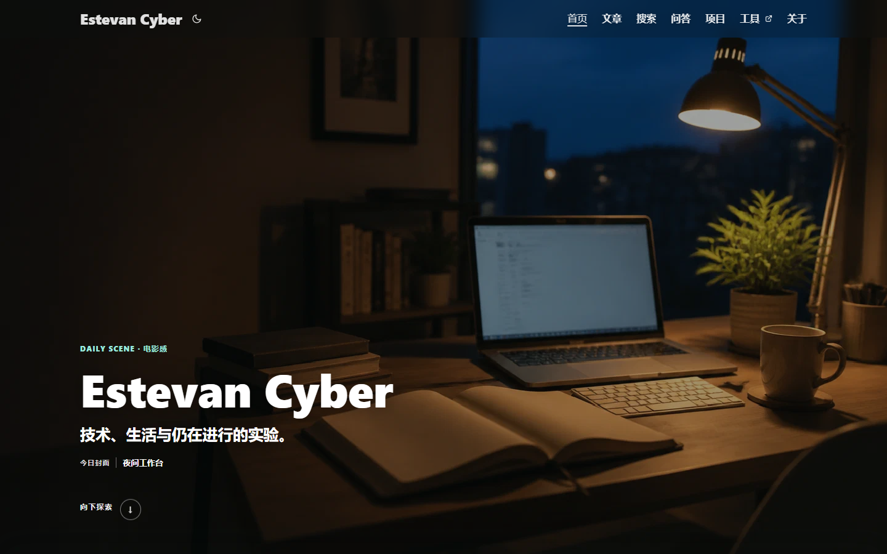
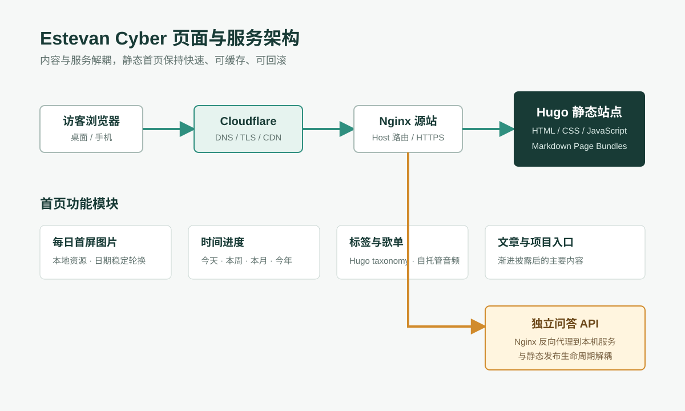
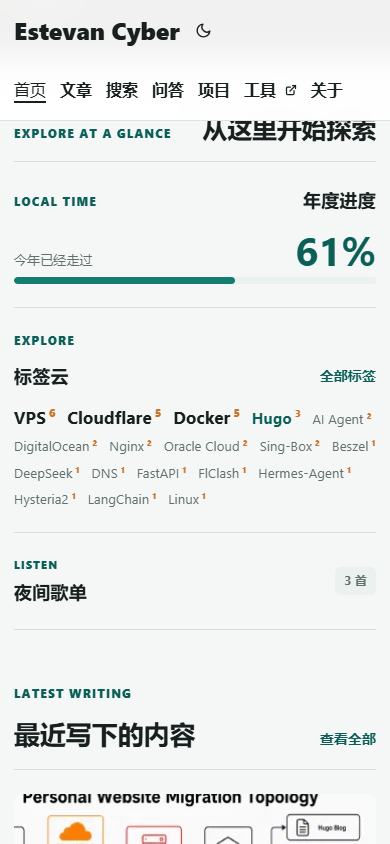
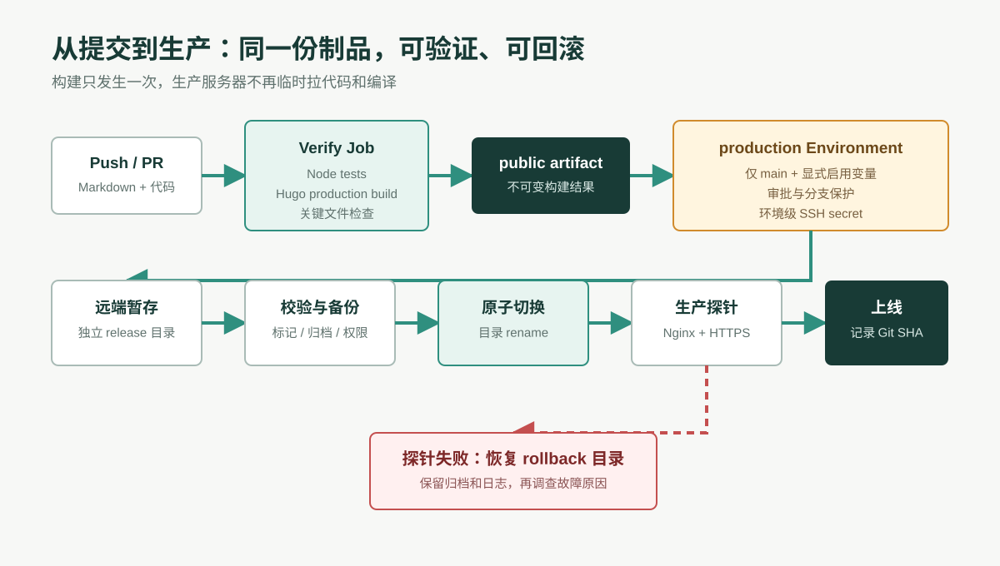

这次改造不是简单换一套颜色，也没有把十几个组件塞进首屏后宣布“信息丰富”。目标更具体：让第一次来访的人先记住这个网站，再让真正想阅读的人快速找到文章、项目和问答入口。

最终首页由一张全屏图片开场，向下滚动才出现时间进度、标签、歌单和文章列表。代码仍然是 Hugo、HTML、CSS 和原生 JavaScript，没有引入重量级前端框架。发布流程则从“登录服务器后手敲命令”改成“提交代码、自动验证、发布同一个构建产物、失败自动回滚”。



## 一、设计目标

原首页的问题不是功能少，而是层级弱：导航、介绍、文章和工具都在争夺注意力，访客一眼就能看到底，却不知道先看什么。改造时定了四条约束：

1. 首屏只保留身份、简短说明和一个明确的探索动作。
2. 重要功能不删除，但必须在用户滚动后按层级出现。
3. 默认使用明亮、克制的视觉，不把“网络安全”误解成满屏荧光绿和终端雨。
4. 手机端不是桌面端缩小版，文字、触控区域和图片裁切都要单独验收。

这里的关键不是“酷炫”，而是信息优先级。动画和图片只是手段；如果访客找不到文章，视觉特效再多也只是昂贵的路障。

## 二、渐进式披露：先看见，再探索

渐进式披露（Progressive Disclosure）指的是先呈现当前最需要的信息，把次要内容留到用户主动操作之后。首页把它实现成两层：

```text
第一层：全屏图片 + 站点身份 + 向下探索
第二层：时间进度 + 标签 + 歌单 + 最新文章 + 项目入口
```

首屏使用 `100svh`，比单纯的 `100vh` 更适合移动浏览器动态地址栏。探索按钮链接到 `#home-content`，所以即使 JavaScript 失效，页面仍可通过原生锚点继续访问。启用 JavaScript 后只增强滚动体验，不把内容可用性押在脚本上。

```html
<a class="ec-hero__discover" href="#home-content">向下探索</a>
```

这也是“渐进增强”的基本原则：HTML 负责结构和最低可用性，CSS 负责表达，JavaScript 负责增强。三者职责混在一起，后期维护通常会变成一场互相甩锅的家庭会议。

## 三、技术栈与页面架构

网站继续采用 Hugo 生成静态页面，Nginx 提供源站服务，Cloudflare 负责公网代理、TLS 和缓存。知识库问答 API 仍是独立服务，不和静态站点的构建生命周期绑死。



核心技术栈如下：

| 层级 | 技术 | 作用 |
| --- | --- | --- |
| 内容 | Markdown + Hugo Page Bundle | 文章、封面和配图放在同一目录 |
| 模板 | Hugo partials | 拆分 Hero、进度、标签、歌单和文章列表 |
| 样式 | 原生 CSS | 响应式布局、明暗主题、减少动画偏好 |
| 交互 | 原生 JavaScript | 每日图片、时间计算、歌单控制 |
| 测试 | Node.js test runner | 算法测试和页面契约测试 |
| 交付 | GitHub Actions + SSH | 构建、校验、上传、切换和回滚 |
| 运行 | Nginx + Cloudflare | 静态文件、HTTPS 源站和边缘代理 |

首页模板不再是一份几百行的大文件，而是由职责明确的 partial 组成。结构发生变化时，可以先修改契约测试，再只动对应组件，避免“改个歌单，首页布局顺便去世”。

## 四、每日轮换的首屏图像

首页准备一组经过筛选和压缩的本地图片，涵盖风景、人物、影视氛围和生活题材。脚本按本地日期计算稳定索引：同一天刷新不会频繁跳图，第二天自然切换，也不依赖第三方随机图片接口。

```js
const dayNumber = Math.floor(Date.now() / 86_400_000);
const image = images[dayNumber % images.length];
```

图片保存在站点仓库中，因此构建结果可复现，也不会因为外部接口限流让首页突然变成空白。Hugo 官方的[图像处理文档](https://gohugo.io/content-management/image-processing/)说明了 `Resize`、`Fit`、`Fill`、`Crop` 等资源处理方法；后续可在构建阶段进一步生成 WebP/AVIF 和多尺寸 `srcset`。

当前实现还遵守三个底线：图片必须有替代文本；文字区域要有足够的遮罩对比度；图片加载失败时保留可读背景色。壁纸负责欢迎访客，不负责绑架首屏性能。

## 五、四类时间进度

最初只显示年度进度，信息密度太低。这次扩展为今天、本周、本月和今年四项，桌面端采用 2×2，手机端改为单列。

| 周期 | 起点 | 终点 | 特别处理 |
| --- | --- | --- | --- |
| 今天 | 本地 00:00 | 次日 00:00 | 使用访客本地时区 |
| 本周 | 周一 00:00 | 下周一 00:00 | 将 JavaScript 的周日索引转换为周一开周 |
| 本月 | 当月 1 日 | 下月 1 日 | 自动适配 28 至 31 天 |
| 今年 | 1 月 1 日 | 下一年 1 月 1 日 | 自动覆盖闰年 |

统一公式并不复杂：

```text
进度 = (当前时间 - 周期起点) / (周期终点 - 周期起点) × 100%
```

真正容易出错的是边界。比如直接把“一年”写成 365 天，闰年就会安静地错上一整年；把周日当成第一天，又会和中文用户通常理解的“本周”不一致。因此算法有独立单元测试，模板还有契约测试检查四项顺序和无障碍标签。

## 六、歌单、标签与内容入口

歌单先采用 3 至 5 首自托管音乐，曲目通过 `data/playlist.yaml` 手动维护。这样不会受第三方播放器接口变动影响，也方便以后替换音频。音频必须确认拥有传播权限；“网上能听到”并不等于“可以重新托管”。

标签云来自 Hugo taxonomy，字号根据文章数量做有限分级。它的作用是提供主题入口，不是用五颜六色证明 CSS 会算随机数。首页同时保留最新文章、项目、工具和问答入口，让探索感最终落到可访问的内容上。

## 七、响应式与无障碍

手机端重点检查四件事：

1. Hero 使用安全视口高度，浏览器工具栏变化时不裁掉探索按钮。
2. 进度模块从双列变为单列，百分比和标签不互相挤压。
3. 文章封面移到正文上方，避免窄屏形成两条细长栏。
4. 音乐控制和导航保留足够触控尺寸。



动画还响应 `prefers-reduced-motion`。W3C 的 WCAG 技术说明建议通过 [`prefers-reduced-motion`](https://www.w3.org/WAI/WCAG22/Techniques/css/C39) 禁用由交互触发的非必要动画，因此站点在该偏好下取消平滑滚动和大部分过渡。

## 八、测试与质量检查

这个项目没有把“浏览器里看着还行”当作测试体系。当前检查分三层：

```text
算法测试：日期边界、闰年、周一起始、百分比裁剪
契约测试：组件、文章章节、资源、部署保护项是否存在
浏览器检查：桌面和手机截图、溢出、控制台、真实导航
```

常用命令：

```bash
node --test tests/*.test.js
hugo --gc --minify --environment production --cleanDestinationDir
```

Hugo 构建后还要检查首页、教程文章、CSS、JavaScript 和媒体资源是否进入 `public/`。静态站点“编译成功”只说明模板语法没炸，不代表图片路径、交互和移动布局都正确。

## 九、从手工发布到 GitHub Actions

旧流程需要 SSH 登录服务器、`git pull`、运行 Hugo、清空目录、复制 `public/`。它能工作，但存在三个问题：构建环境漂移、命令容易漏、删除和复制之间会出现短暂不完整状态。

新流程把构建和部署拆成两个 Job：



1. Pull Request 和 `main` 推送都运行 Node 测试与 Hugo 生产构建。
2. 构建生成的 `public/` 作为不可变 artifact 上传。
3. 只有 `main`、仓库变量显式启用、且 `production` Environment 放行时才部署。
4. 部署 Job 下载同一个 artifact，通过 SSH 上传到独立暂存目录。
5. 服务器脚本校验文件、备份旧版本、原子切换目录并执行探针。

GitHub 官方文档明确说明，[workflow artifacts](https://docs.github.com/en/actions/concepts/workflows-and-actions/workflow-artifacts)适合在 Job 之间共享构建结果；[deployment environments](https://docs.github.com/en/actions/reference/workflows-and-actions/deployments-and-environments)可以设置审批、分支限制和环境级 secrets；[concurrency](https://docs.github.com/en/actions/concepts/workflows-and-actions/concurrency)可避免多个生产发布互相覆盖。

仓库里不会出现服务器私钥。SSH 私钥只存入 `production` Environment 的 `VPS_SSH_KEY` secret，主机、用户和端口使用环境变量。GitHub 对 [Actions secrets](https://docs.github.com/en/actions/concepts/security/secrets) 的建议同样是最小权限、定期轮换，并避免在日志中输出敏感值。

Cloudflare Pages 也支持 [Hugo 的原生构建和 Git 集成](https://developers.cloudflare.com/pages/framework-guides/deploy-a-hugo-site/)，未来如果把纯静态博客迁到 Pages，可以进一步减少 VPS 上的发布职责。但当前站点还有 Nginx 路由、工具页和 API，因此先把现有架构自动化，比为了“云原生”三个字立刻拆迁更稳妥。

## 十、回滚策略

部署脚本不直接 `rm -rf /var/www/blog/*`。它先完成以下动作：

```text
校验暂存路径和 Git SHA
检查 index.html、文章页、CSS、JS、媒体文件
把当前站点打成时间戳归档
将旧目录改名为 rollback 目录
将新目录原子移动为 /var/www/blog
执行 Nginx 配置检查和本地 HTTPS 探针
失败则立即换回旧目录
```

Linux 同一文件系统内的目录改名是原子的，访客不会撞上“旧文件删完、新文件只复制一半”的窗口。归档用于较长期恢复，rollback 目录用于秒级回退，两者解决的时间尺度不同。

## 十一、我的学习路线

这次大部分实现由 Codex 协助完成，但代码最终属于仓库维护者。要让它真正变成“我的网站”，接下来按这个顺序理解最有效：

1. 从 `layouts/index.html` 追踪首页 partial 的组合关系。
2. 阅读 `assets/js/home-progress.js`，手算一天和一周的边界测试。
3. 修改 `data/playlist.yaml` 和首页关注项，理解数据与模板的分工。
4. 新建一个 Hugo Page Bundle，加入封面和文章内图片。
5. 阅读 `.github/workflows/site.yml`，区分 build artifact、secret、variable 和 environment。
6. 在测试环境故意让探针失败，观察 `scripts/deploy-site.sh` 如何回滚。

自动化的价值不是让人不再理解系统，而是把已经理解的步骤固化下来。否则所谓 CI/CD，不过是把手工事故改成高速批量事故。

---

本次改造对应的设计说明、实施计划、测试和部署脚本都保存在公开仓库中。后续优化会优先关注图片响应式处理、内容检索、Web Vitals 和更细的可访问性检查，而不是继续给首页叠挂件。
