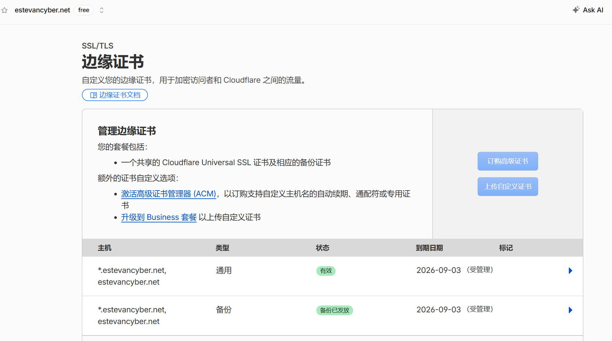

这篇文章记录一次真实的个人网站迁移：DigitalOcean VPS 即将到期，需要把网站主体迁到 Oracle Cloud，同时尽量不影响线上访问。

迁移对象并不只是一组 HTML 文件，而是四块互相依赖的服务：

```text
Hugo 博客               /var/www/blog
静态工具页              /var/www/tools
FastAPI 知识库问答       127.0.0.1:8000
Beszel 监控 Agent        主动连接旧 Oracle 上的 Hub
```

最终采用的方案是：

```text
新 Oracle：203.0.113.10   承载网站、Nginx、API、Beszel Agent
旧 Oracle：198.51.100.20 保留 Beszel Hub 和已有代理节点
DigitalOcean：192.0.2.30 暂留 3 至 7 天，作为回滚源
```

Hermes 和 DigitalOcean 上的代理节点没有纳入这次迁移。把所有项目一股脑塞进 1C1G，只能得到一个配置表看起来很勤奋、实际谁都喘不过气的服务器。

文中的公网 IP 已统一替换为 [RFC 5737](https://datatracker.ietf.org/doc/html/rfc5737) 文档示例地址，避免公开真实源站。读者需要换成自己的服务器地址。

---

## 一、先定义“迁移成功”

DNS 指向新 IP，只能证明你会改表单，不能证明迁移成功。

这次我把验收标准定为：

1. 博客首页、文章页、工具页和 API 域名都返回 `200`。
2. Nginx 在新服务器上正确处理 HTTPS 和各个 Host。
3. 问答 API 不只通过健康检查，还能完成一次真实提问。
4. Hugo 原始 Markdown、静态文件、Nginx 配置和 API 环境变量完整迁移。
5. Beszel 能看到新服务器和容器指标。
6. Cloudflare 切流量后，能从新 Nginx 日志中找到唯一探针请求。
7. 旧 DigitalOcean 在观察期内保持可回滚，不立即销毁。

这个定义很重要。否则最常见的“迁移完成”，其实只是首页缓存还在，API 已经悄悄躺平。

---

## 二、盘点服务与资源

### 1. 在源服务器收集清单

先记录系统、资源、监听端口和容器：

```bash
uname -a
nproc
free -h
df -hT
sudo ss -lntup
sudo docker ps --format 'table {{.Names}}\t{{.Image}}\t{{.Ports}}\t{{.Status}}'
sudo nginx -T > /tmp/nginx-full.txt
```

还要列出不能丢的目录：

```bash
sudo du -sh /var/www/blog /var/www/tools /var/www/sub /opt/estevancyber-blog
sudo find /etc/nginx/sites-enabled -maxdepth 1 -type l -ls
```

### 2. 评估 1C1G 是否够用

新 Oracle 是 1C1G。实测迁移后约使用 305 MiB 内存，API 容器约 105 MiB，Beszel Agent 约 10 MiB，并配置了 2 GiB swap。对低流量 Hugo 静态站、单个 FastAPI 服务和监控 Agent 来说够用。

但这个结论有边界：

- 适合：静态网站、轻量 API、低并发个人项目。
- 勉强：频繁重建索引、并行 Docker 构建、多个 Python 服务。
- 不适合：再叠加 Hermes、浏览器自动化、本地大模型或高并发任务。

如果重新开机，优先选 Ubuntu 22.04 或 24.04。Docker 当前官方 Ubuntu 安装文档列出的受支持版本已经不包含 20.04；本次迁移沿用了现有 20.04 实例，但不值得把旧选择包装成新建议。Docker 同时支持 `amd64` 和 `arm64`，如果改用 Ampere A1，需要先确认所有镜像都有 ARM64 构建。[Docker 官方 Ubuntu 安装文档](https://docs.docker.com/engine/install/ubuntu/)

---

## 三、制作可校验备份

### 1. 备份的内容

至少包括：

```text
/var/www/blog
/var/www/tools
/opt/estevancyber-blog
/etc/nginx/sites-available
/etc/nginx/ssl
API 的环境变量文件
```

证书私钥和 API Key 也属于迁移数据，但绝不能提交到 GitHub 或夹在教程截图里。

### 2. 在源服务器打包

```bash
STAMP=$(date +%Y%m%d-%H%M%S)
sudo install -d -m 700 /root/migration-export

sudo tar --acls --xattrs -czf \
  "/root/migration-export/site-$STAMP.tar.gz" \
  /var/www/blog \
  /var/www/tools \
  /opt/estevancyber-blog \
  /etc/nginx/sites-available \
  /etc/nginx/ssl

sudo chmod 600 "/root/migration-export/site-$STAMP.tar.gz"
sudo sha256sum "/root/migration-export/site-$STAMP.tar.gz" \
  | sudo tee "/root/migration-export/site-$STAMP.sha256"
```

这里的 SHA-256 不是仪式感。传输前后哈希一致，才有资格说“文件没坏”。

本次实际归档的校验值为：

```text
cc9a6d30ce9bb2dfc87a98e05dcb200e2648a1d84b9bb1bd514041b12a9a5a51
```

公开校验值没有问题，但归档本身含敏感配置，应只存放在受控位置。

### 3. 传到新服务器后复核

```bash
sha256sum site-*.tar.gz
```

确认哈希相同后再解压。不要把 `scp` 进度条走到 100% 当作数据完整性证明，进度条没有这个职业资格。

---

## 四、准备新 Oracle 源站

### 1. 安装基础组件

```bash
sudo apt update
sudo apt install -y nginx ca-certificates curl gnupg jq
```

Docker 建议按官方 APT 仓库安装，不要在生产机上无脑执行来历不明的“一键脚本”。完整命令以 [Docker 官方文档](https://docs.docker.com/engine/install/ubuntu/) 为准，安装后验证：

```bash
sudo systemctl enable --now docker nginx
sudo docker version
sudo docker compose version
sudo nginx -t
```

### 2. 给 1G 内存增加 swap

```bash
sudo fallocate -l 2G /swapfile
sudo chmod 600 /swapfile
sudo mkswap /swapfile
sudo swapon /swapfile

grep -q '^/swapfile ' /etc/fstab \
  || echo '/swapfile none swap sw 0 0' | sudo tee -a /etc/fstab
```

验证：

```bash
free -h
swapon --show
```

swap 是保险丝，不是内存扩容魔法。服务长期大量换页时，正确动作仍然是减负或升级配置。

### 3. 配置两层防火墙

OCI 的 Security List 或 Network Security Group 是云侧虚拟防火墙，Ubuntu 自己还有主机防火墙。任何一层拒绝，外部都访问不到。Oracle 官方也明确要求排障时同时检查云侧规则和实例内规则。[OCI Security Lists](https://docs.oracle.com/en-us/iaas/Content/Network/Concepts/securitylists.htm)

网站服务器建议只开放：

| 用途 | 协议/端口 | 来源 |
|---|---:|---|
| SSH | TCP 22 | 自己的固定 IP，条件允许时不要全网开放 |
| HTTP | TCP 80 | `0.0.0.0/0` 和需要时的 `::/0` |
| HTTPS | TCP 443 | `0.0.0.0/0` 和需要时的 `::/0` |

不需要为 FastAPI 开放公网 `8000`，容器只绑定到回环地址：

```yaml
ports:
  - "127.0.0.1:8000:8000"
```

Beszel Agent 采用主动连接 Hub 的 WebSocket 模式时，也不需要新增公网入站端口。

另外，Docker 官方文档特别提醒：已发布的容器端口可能绕过 UFW/firewalld 规则。不要一边用 `ufw deny` 自我感动，一边让 Docker 把端口从侧门端出来；敏感端口优先绑定 `127.0.0.1`，复杂规则放到 `DOCKER-USER` 链处理。[Docker 防火墙说明](https://docs.docker.com/engine/install/ubuntu/#firewall-limitations)

---

## 五、恢复网站与 API

### 1. 恢复目录并检查权限

```bash
sudo install -d /var/www/blog /var/www/tools /opt/estevancyber-blog
sudo tar -xzf site-*.tar.gz -C /

sudo chown -R www-data:www-data /var/www/blog /var/www/tools
sudo find /var/www/blog /var/www/tools -type d -exec chmod 755 {} \;
sudo find /var/www/blog /var/www/tools -type f -exec chmod 644 {} \;
```

源码目录不应该长期由 `root` 随意构建。发布账号、目录归属和 Git `safe.directory` 最好一次整理清楚，否则下一次 `git pull` 又会假装第一次认识你。

### 2. 恢复问答 API

本项目的 API 容器名为 `estevan-knowledge-agent`，主要接口包括：

```text
GET  /api/health
POST /api/ask
POST /api/reindex
```

环境变量文件包含 DeepSeek、Tavily 等密钥。迁移时做三件事：

1. 通过安全通道复制，不进入 Git。
2. 对比源端和目标端文件哈希。
3. 不输出文件内容，只检查变量是否存在。

```bash
sha256sum /secure/path/agent.env
grep -E '^[A-Z0-9_]+=' /secure/path/agent.env | cut -d= -f1
```

启动后检查：

```bash
sudo docker compose up -d --build
sudo docker ps
curl -fsS http://127.0.0.1:8000/api/health | jq
```

健康检查通过仍不够，还要执行一次真实提问：

```bash
curl -fsS -X POST http://127.0.0.1:8000/api/ask \
  -H 'Content-Type: application/json' \
  -d '{"question":"这个网站有哪些主要内容？","session_id":"migration-check"}' \
  | jq
```

本次迁移后，知识库加载了 8 篇文档、22 个切片；两次真实问答约耗时 7 至 8 秒，并正常返回 `sources`、`session_id` 和 `trace_id`。这说明模型 Key、联网搜索 Key、知识库目录挂载和 Nginx 代理链路都在工作，不需要因为换了 VPS 就重新申请 API Key。

不过，密钥从旧机复制到新机后，攻击面已经发生变化。等旧机销毁时轮换一次密钥，是更稳妥的收尾。

---

## 六、配置 Nginx 与 Origin CA

### 1. 静态站与 API 分流

核心结构如下：

```nginx
server {
    listen 80;
    listen [::]:80;
    server_name blog.example.com;
    return 301 https://$host$request_uri;
}

server {
    listen 443 ssl;
    listen [::]:443 ssl;
    server_name blog.example.com;

    ssl_certificate     /etc/nginx/ssl/example/origin.pem;
    ssl_certificate_key /etc/nginx/ssl/example/origin.key;

    root /var/www/blog;
    index index.html;

    location / {
        try_files $uri $uri/ =404;
    }
}
```

API 子域名只由 Nginx 访问回环地址：

```nginx
location / {
    proxy_pass http://127.0.0.1:8000;
    proxy_set_header Host $host;
    proxy_set_header X-Real-IP $remote_addr;
    proxy_set_header X-Forwarded-For $proxy_add_x_forwarded_for;
    proxy_set_header X-Forwarded-Proto $scheme;
}
```

检查后再重载：

```bash
sudo nginx -t
sudo systemctl reload nginx
```

### 2. 边缘证书不等于源站证书



Cloudflare 页面上显示的三个月有效期，是浏览器到 Cloudflare 这一段使用的边缘证书。它由 Cloudflare 托管和续期，不需要因为源站换 IP 就重新生成。

Cloudflare 到 Nginx 使用的是 Origin CA 证书。本次把已有的通配符证书和私钥安全复制到新服务器，证书覆盖：

```text
*.estevancyber.net
estevancyber.net
```

并保持：

```text
Cloudflare SSL/TLS mode = Full (strict)
```

`Full (strict)` 会验证源站证书是否未过期、主机名是否匹配，并且是否由公共 CA 或 Cloudflare Origin CA 签发。[Cloudflare Full (strict) 文档](https://developers.cloudflare.com/ssl/origin-configuration/ssl-modes/full-strict/)

Origin CA 证书只被 Cloudflare 信任。如果把 DNS 改成灰云后让浏览器直接访问源站，浏览器出现“不受信任”并不奇怪。这也是为什么 Origin CA 适合只接收 Cloudflare 代理流量的源站。[Cloudflare Origin CA 文档](https://developers.cloudflare.com/ssl/origin-configuration/origin-ca/)

---

## 七、切 DNS 前先直测新源站

这是整个流程里最值钱的一步。

DNS 还指向旧机时，用 `--resolve` 强制把域名请求发给新 IP：

```bash
NEW_IP=203.0.113.10

curl -kI --resolve blog.estevancyber.net:443:$NEW_IP \
  https://blog.estevancyber.net/

curl -kI --resolve tools.estevancyber.net:443:$NEW_IP \
  https://tools.estevancyber.net/

curl -k --resolve api.estevancyber.net:443:$NEW_IP \
  https://api.estevancyber.net/api/health
```

这里使用 `-k`，是因为直连测试绕过了 Cloudflare，而 Origin CA 本来就不在浏览器和系统公共信任库中。它只用于切流前诊断，不应该成为日常访问习惯。

再单独查看源站证书：

```bash
openssl s_client \
  -connect 203.0.113.10:443 \
  -servername blog.estevancyber.net </dev/null 2>/dev/null \
  | openssl x509 -noout -subject -issuer -dates
```

只有新源站的页面、API、证书和日志都正确，才进入 DNS 切换。这样问题被限制在源站内部，不必一边面对用户流量，一边猜是哪层出了毛病。

---

## 八、切换 Cloudflare DNS

网站相关记录更新为新 Oracle IP，并保持橙云：

```text
@       A       203.0.113.10   Proxied
blog    A       203.0.113.10   Proxied
tools   A       203.0.113.10   Proxied
api     A       203.0.113.10   Proxied
www     CNAME   estevancyber.net Proxied
```

Cloudflare 官方建议为 Web 流量代理 A、AAAA 和 CNAME 记录；橙云会隐藏源站 IP，并让流量经过 TLS、缓存和安全规则。[Cloudflare Proxy status](https://developers.cloudflare.com/dns/proxy-status/)


上图记录了切换时的状态，也顺便留下一个很有价值的错误示范：`node` 一度也被改到了新 IP 并开启橙云。

`node.estevancyber.net` 承载的是旧 Oracle 上的 Reality/Hysteria 等非普通 Web 服务，本次没有迁移。正确处理应是：

```text
node    A    198.51.100.20    DNS only
```

Cloudflare 免费代理默认只支持指定的 HTTP/HTTPS 端口，不能把 SSH、Reality 或任意 TCP 端口当普通橙云网站转发。[Cloudflare 支持的代理端口](https://developers.cloudflare.com/fundamentals/reference/network-ports/)

还要检查是否残留旧 `AAAA` 记录。A 记录已经指向新 IPv4，但 AAAA 仍指向旧 IPv6 时，部分用户会稳定地访问错误源站，这种故障尤其擅长把人折磨成“我这里明明可以”。

---

## 九、证明 Cloudflare 已经打到新机

### 1. 检查所有入口

```bash
curl -fsSI https://estevancyber.net/
curl -fsSI https://www.estevancyber.net/
curl -fsSI https://blog.estevancyber.net/
curl -fsSI https://tools.estevancyber.net/
curl -fsS  https://api.estevancyber.net/api/health | jq
```

### 2. 用唯一 User-Agent 做日志取证

在本地发送：

```bash
PROBE="migration-probe-$(date +%s)"
curl -A "$PROBE" -fsSI https://blog.estevancyber.net/
echo "$PROBE"
```

在新服务器查日志：

```bash
sudo grep 'migration-probe-' /var/log/nginx/access.log | tail
```

如果唯一探针出现在新机日志里，就能证明 Cloudflare 当前回源到了新 Oracle。比起“我刷新了几次，看着挺正常”，这才算证据。

本次验收结果：

| 检查项 | 结果 |
|---|---|
| 主域名、www、blog、tools、api | 全部正常 |
| 站内 9 个链接 | 全部返回 `200` |
| TLS | 校验正常 |
| 新 Nginx 唯一探针 | 已命中 |
| API health | 正常 |
| API 真实问答 | 正常，约 7 至 8 秒 |
| Beszel Agent | 在线，可见容器与系统资源 |

现有 Hugo 模板还引用了 5 个不存在的 favicon 文件，因此这些静态资源返回 `404`。这是原站遗留问题，不是迁移丢文件；它不影响主站和问答功能，但应单独修复，别把历史欠账栽到搬家头上。

---

## 十、Beszel：新机只需 Agent

Beszel Hub 已经运行在旧 Oracle `198.51.100.20:8090`，新 Oracle 不需要再部署第二个 Hub，只需运行 Agent。

Beszel 支持 Docker、二进制等多种 Agent 安装方式；主动连接模式使用 `KEY`、`TOKEN` 和 `HUB_URL`，由 Agent 发起 WebSocket 出站连接。[Beszel Agent 安装文档](https://beszel.dev/guide/agent-installation)

配置时注意：

- 公钥不是私钥，可以放在 Agent 配置中。
- Token 仍然是凭据，不应公开在文章、截图或仓库里。
- 同一 Oracle VCN 内优先使用私网地址连接 Hub。
- Agent 挂载 Docker socket 时使用只读方式，并理解该接口仍然具有较高权限。

```yaml
volumes:
  - /var/run/docker.sock:/var/run/docker.sock:ro
```

---

## 十一、BBR 要不要开

新 Oracle 当前使用 `cubic + fq_codel`，内核支持 BBR，但没有立即切换。

原因很简单：这个站点的主要流量经过 Cloudflare，内容以静态页面和小体积 API 响应为主，当前瓶颈不是拥塞控制算法。BBR 可能改善高延迟、丢包链路上的吞吐，但它不会修复错误的 DNS、证书、Nginx 配置或资源不足。

建议顺序：

1. 先观察 3 至 7 天的延迟、丢包、CPU、内存和 API 响应。
2. 确认存在网络吞吐问题后再做基准测试。
3. 变更前后使用相同地区、相同时间段、相同工具对比。

为了“优化”而优化，通常只是给配置文件增加行数，性能并不会被文字数量打动。

---

## 十二、回滚与旧机销毁清单

### 1. 回滚方式

观察期内不要停止旧 DigitalOcean 的 Nginx 和 API。若新机出现严重问题：

1. 把 Web A 记录改回 `192.0.2.30`。
2. 保持 Cloudflare 橙云和 `Full (strict)`。
3. 验证旧源站恢复。
4. 在新机继续排错，不要在生产流量下盲修。

### 2. 什么时候可以销毁 DigitalOcean

满足下面全部条件后再销毁：

- 连续观察至少 3 至 7 天，没有异常 `5xx` 或频繁重启。
- 博客、工具页、问答 API 和站内链接持续正常。
- Cloudflare 和新 Nginx 日志确认流量只到新机。
- 已检查 A、AAAA、CNAME，没有 Web 记录残留旧 IP。
- 代理节点、订阅 URL、Hermes 等未迁移服务已单独处置。
- 最新备份已下载到本地或对象存储，并验证可解压。
- API Key、Token、SSH Key 已登记，旧机销毁后按计划轮换。
- 已保存 Nginx、Docker Compose、证书和恢复步骤。

销毁前最好先做 DigitalOcean Snapshot 或最终归档。多留几天服务器的费用，通常比在凌晨重建一套丢了配置的服务便宜得多。

---

## 十三、这次迁移最值得复用的原则

```text
先盘点，再备份
先校验归档，再恢复
先直测源站，再改 DNS
先做真实业务请求，再宣布成功
先观察几天，再销毁旧机
```

Cloudflare 让切流量变得方便，但迁移可靠性仍然来自可验证的备份、最小开放端口、清晰的服务边界和明确的回滚路径。只改 DNS 是搬门牌号；把数据、运行环境、证书、监控和验收一起迁过去，才叫搬家。

---

## 参考资料

- [Cloudflare：Full (strict) SSL/TLS 模式](https://developers.cloudflare.com/ssl/origin-configuration/ssl-modes/full-strict/)
- [Cloudflare：Origin CA](https://developers.cloudflare.com/ssl/origin-configuration/origin-ca/)
- [Cloudflare：DNS Proxy status](https://developers.cloudflare.com/dns/proxy-status/)
- [Cloudflare：可代理的网络端口](https://developers.cloudflare.com/fundamentals/reference/network-ports/)
- [Oracle Cloud：Security Lists](https://docs.oracle.com/en-us/iaas/Content/Network/Concepts/securitylists.htm)
- [Docker：Install Docker Engine on Ubuntu](https://docs.docker.com/engine/install/ubuntu/)
- [Beszel：Agent Installation](https://beszel.dev/guide/agent-installation)

