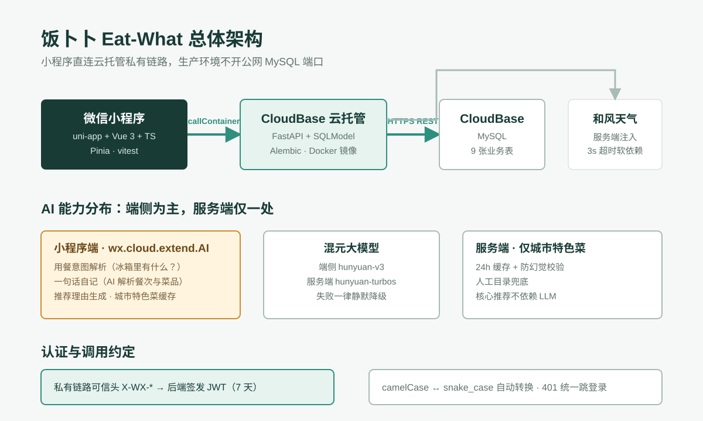
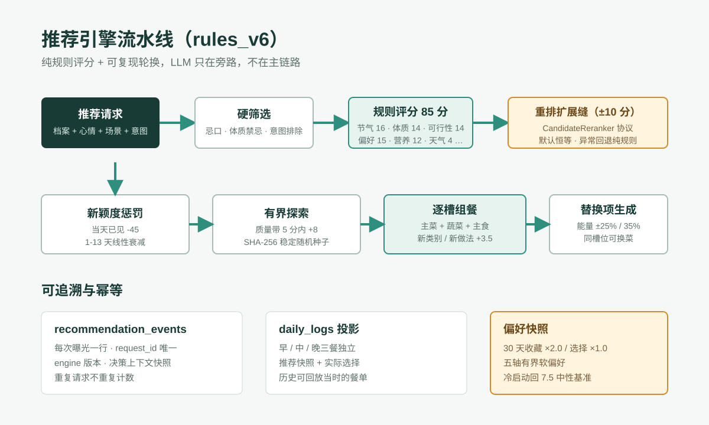

「今天吃啥嘞？」是家里每天都要面对的问题。饭卜卜 Eat-What 这个小程序就是为它写的：根据人数、做饭还是外食、心情、活动量、忌口、体质、节气与天气，推荐更合适的一餐。这篇文章不复述产品功能，而是把它当成一个工程样本来拆：模块怎么分、技术栈怎么选、核心链路怎么走、改一个功能会牵动哪些地方。

先给结论：这是一个「前端重体验、后端重规则、AI 在旁路」的三层结构。推荐这件事没有押注大模型，AI 全部放在可降级的增强位上——模型不可用时，基础推荐完全不受影响。



## 一、技术栈与总体架构

| 层级 | 技术 | 要点 |
| --- | --- | --- |
| 小程序 | uni-app + Vue 3 + TypeScript | 一套代码编译到微信小程序与 H5 |
| 状态 | Pinia（4 个 store） | user / daily / dining / favorite |
| 后端 | FastAPI + SQLModel + Alembic | Python 3.10+，Docker 镜像部署 |
| 托管 | CloudBase 云托管 | 小程序经 `wx.cloud.callContainer` 私有链路直连 |
| 数据库 | CloudBase MySQL（HTTPS REST） | 生产不开公网 MySQL TCP 端口 |
| AI | 混元（端侧 + 服务端各一处） | 端侧 `wx.cloud.extend.AI`，服务端仅城市特色菜 |
| 外部 | 和风天气 · lunar_python | 天气软依赖；节气农历离线计算 |

调用链一句话：微信小程序 → `wx.cloud.callContainer` → CloudBase 云托管上的 FastAPI → CloudBase MySQL 的 HTTPS REST API。不需要单独购买 VPS 跑后端，微信 AppSecret 也不进入前端和 Git。

质量数据先放在这里，后面每一条设计都会落到这些数字上：后端 430 项 pytest + ruff + mypy strict，前端 128 项 vitest + eslint + vue-tsc，两端各自有构建产物校验。

## 二、前端：页面、状态与网络层

### 2.1 页面与模块划分

小程序注册了 10 个页面，其中 5 个是 tabBar：今天（推荐）、档案、体质、日记、我的；另外 5 个是跳转页：菜谱详情、登录、收藏、外食记录、完善资料。`src/` 下的目录按职责切分：

```text
miniapp/src/
├── ai/          # 端侧 AI：意图解析、一句话自记、推荐理由、特色菜
├── api/         # 网络层：transport 抽象 + 按域划分的 API 模块
├── stores/      # Pinia：user / daily / dining / favorite
├── domain/      # 纯函数领域逻辑：换菜、营养汇总、天气格式化
├── components/  # MealPlateCard、MealSubstitution、WeatherBadge 等
└── types/       # openapi-typescript 从后端 OpenAPI 生成的类型
```

值得点名的是 `types/api.ts`：它由 `npm run gen:api` 从后端 OpenAPI schema 自动生成，前后端的契约不是靠人肉对文档，而是靠生成器。后端改了响应结构，前端类型检查立刻报错。

### 2.2 网络层：一次传输抽象

`api/transport.ts` 定义了 `Transport` 接口，微信端用 CloudTransport（封装 `wx.cloud.callContainer`），H5 用 HttpTransport（`uni.request`）。统一内核 `request()` 在传输之上做了五件事：

1. 入参 camelCase 自动转 snake_case，出参反向转换——前后端各自用最自然的命名；
2. 解包 `{ok, code, data}` 统一响应壳；
3. 自动附加 `Authorization: Bearer`；
4. 冷启动重试：个人版容器会缩容、MySQL 会自动暂停，所以设 20 秒超时，GET 与 5xx 各重试一次；
5. 401 全局拦截跳登录页，带 redirect 参数。

这五件事都不属于任何具体业务，却决定了所有业务代码的手感。写小程序网络层时最容易被跳过的就是第 4 件——本地调试永远热着，线上冷启动的第一次超时才教人做人。

### 2.3 状态：四个 store 各管一段

`daily` 是最重的 store：推荐上下文（心情、活动量、场景、人数、城市、餐次）、天气快照、推荐缓存（带版本号的 storage 结构）、`fetchRecommend`（requestId + 本地换菜去重）、换菜与确认。`user` 管登录态与档案，`dining` 管外食方向的本地去重轮换，`favorite` 管收藏集合。

## 三、后端：路由、仓储与双数据库后端

`app/` 的分层是经典的路由 → 服务 → 仓储三层，加上 schemas（Pydantic DTO）与 models（SQLModel 表模型）。8 个路由模块对应 8 个业务域，约 30 个端点：认证、档案、体质、菜品目录、今日上下文（节气/天气）、日记与推荐、外食、收藏。

最有架构味道的一处是数据库双后端：`get_db()` 按 `database_backend` 配置返回 SQLAlchemy Session 或 `CloudBaseRepository`。本地开发和测试走 SQLAlchemy 直连，生产走 CloudBase MySQL 的 HTTPS REST API——云托管个人版拿不到 VPC 内的 TCP 端口，所有 SQL 都翻译成 REST 调用。仓储层为此处理了不少方言差异，比如布尔条件在 REST 过滤语法里要写成 `is.true` 这种字符串谓词。

9 张表里有两张专为可追溯设计：`recommendation_events` 每次推荐曝光写一行，`request_id` 唯一约束做幂等，带 engine 版本和决策上下文快照；`daily_logs` 是它的投影，记录三餐独立的推荐快照与实际选择。事后回看任何一天的日记，都能还原「当时为什么推这道菜」。

## 四、推荐引擎：规则评分 + 可复现轮换

推荐是整个产品的核心，也是代码量最大的服务。主入口 `recommend()` 的流水线如下：



### 4.1 硬筛与九项评分

先硬筛：只保留有完整菜谱的菜，剔掉忌口标签、体质禁忌和 AI 意图里点名排除的食材。剩下的候选进入 rules_v6 规则评分，九项合计 85 分：

| 评分项 | 权重 | 依据 |
| --- | --- | --- |
| 节气周期 | 16 | 当前节气前/中/后三段匹配菜的应季属性 |
| 体质匹配 | 14 | 九种体质的宜忌 |
| 偏好快照 | 15 | 30 天收藏与选择压缩出的五轴软偏好 |
| 可行性 | 14 | 做法难度、耗时与场景匹配 |
| 营养 | 12 | 蛋白质、膳食纤维等结构 |
| 天气 | 4 | 雨雪干冷热温和六档 |
| 心情 | 5 | 情绪对应的口味倾向 |
| 活动量 | 3 | 能量需求调节 |
| 星座 | 2 | 玄学项，权重最低但用户爱看 |

节气权重最高不是拍脑袋：它是这个产品的差异化记忆点，且由 lunar_python 离线计算，零外部依赖、零失败率。天气只占 4 分，因为天气服务的可用性远不如本地历法——权重设计要跟着依赖的可靠性走。

### 4.2 新颖度与有界探索

「不重复」是推荐类产品的生死线。这里用了三层机制：

- **新颖度惩罚**：当天已见的菜 -45 分，1 到 13 天线性衰减，重复曝光叠加扣分；
- **有界探索**：质量带 5 分以内的候选里，30 天未曝光的 +8 分——探索不牺牲下限；
- **稳定随机**：用请求参数算 SHA-256 做随机种子，同一用户同一上下文得到同一个轮换结果，可复现、可测试。

组餐阶段按槽位（主菜/蔬菜/主食）逐槽选择，每个槽位在选中后动态更新多样性加分（新类别 +3.5、新做法 +3.5），并为每个主槽生成一个能量 ±25%~35% 的替换项，这就是前端「换一个」按钮的数据来源。

### 4.3 预留的 Agent 扩展缝

评分之后有一个 `CandidateReranker` 协议缝：默认是恒等重排，未来的 LLM Agent 只能对已过筛候选做 ±10 分的微调，异常时回退纯规则。这意味着即使以后接入模型重排，坏情况下限仍然是完全可解释的规则推荐。

## 五、账号体系：可信头、JWT 与游客合并

微信登录没有走传统的 code2session（后端默认关闭），而是吃 CloudBase 私有链路注入的可信身份头 `X-WX-OPENID` / `X-WX-APPID` / `X-WX-ENV`，校验通过后签发 7 天 JWT。前端不碰 wx.login 的 code，密钥不出现在任何客户端链路。

更复杂的是游客模式：未登录也能全功能使用，注册时自动合并。合并服务要搬移收藏并去重、把推荐事件改挂到新账号、同餐次的日记行合并、两份健康档案择优合并，最后把游客行标记进合并链。这一块逻辑上千行，是全项目最值得写测试的地方——好在它有。

## 六、AI 的边界：增强而非依赖

AI 能力分布在两处，都不在关键路径上：

**端侧**（`wx.cloud.extend.AI`，混元 v3）：用餐意图解析（「冰箱里有西红柿，15 分钟，想吃酸的」转成推荐约束）、一句话自记（「早上吃了小笼包和豆浆」解析出餐次、菜品与估算能量）、推荐理由文案、城市特色菜。所有端侧 AI 都遵循同一个模式：严格 JSON 输出约束 → 失败重试一次 → 归一化校验 → 仍失败就静默降级（整句存为备注、按钟点推断餐次）。

**服务端仅一处**：按城市推荐本地特色菜，经 CloudBase AI 网关调混元，24 小时缓存，带防幻觉校验（模型报的菜名必须在已知目录里），兜底是人工维护的候选目录。

这套设计的净效果：把混元整个下线，产品依然完整可用，只是少了几处「聪明」的润色。

## 七、修改影响面：动哪里要带伞

架构图看完容易产生「都很清晰」的错觉，真正的架构知识在于知道改动会波及哪里。四类常见变更的影响面：

| 变更 | 必须同步的地方 |
| --- | --- |
| 改推荐算法 | `recommender.py` / `recommendation_ranking.py` / `meal_builder.py` + 对应三组测试；响应契约不变则前端零改动；改权重展示需动 `RecommendationBasis` 组件与 schemas |
| 改数据库 schema | models → 新 Alembic 迁移（REST 双写路径的方言差异）→ schemas → service 查询 → 前端重跑 `gen:api` → 相关 store 与页面；迁移测试与 CloudBase 基线也要同步 |
| 加页面 | `pages.json` 注册（tabBar 页只能 switchTab）；easycom 组件自动注册；分享需实现 `onShareAppMessage` |
| 改认证 | `cloud_context.py`（可信头校验）+ JWT 模块 + 全路由依赖 + 前端 `request.ts`（Bearer 注入与 401 跳转）+ storage 键名 + 游客合并链 + 公开端点白名单 |

规律很朴素：**契约是波及面的一切**。算法内部怎么翻新，只要 `RecommendResponse` 的形状不变，前端就一行不用改；一旦动了 schema 或认证，就是一次贯穿 8 层的远征。

## 八、复盘：做对的事与还欠的账

做对的：传输抽象和统一响应壳让业务代码极干净；`request_id` 幂等加事件表，推荐效果可以被回放和归因；AI 全部可降级；双数据库后端让本地测试不必模拟云环境；OpenAPI 生成类型把契约漂移挡在 CI。

还欠的：`recommendation_ranking.py` 已经长到需要豁免复杂度检查，评分函数的拆分提上日程；历史遗留的 `select_diverse` 选择器存在但主链路未接线，属于待清理的死代码候选；游客合并服务的测试覆盖虽然厚，但每次 schema 演进都要人工过一遍合并语义，值得沉淀成表驱动的合并用例集。

一句话收尾：这个项目最核心的工程决策不是选了哪个框架，而是把「推荐质量」建立在可解释的规则与可回放的数据上，让 AI 只做锦上添花。想吃饭的时候卜一卜，想改代码的时候翻影响面表——两件事都不靠玄学。

项目开源于 [Estevan233/Eat-What](https://github.com/Estevan233/Eat-What)（AGPL-3.0）。
